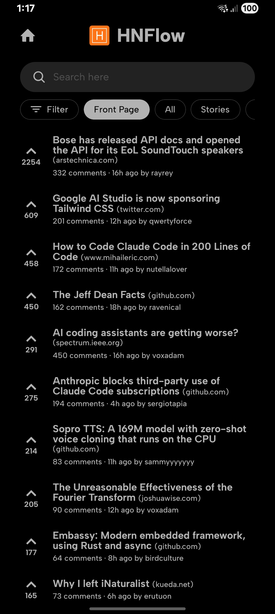
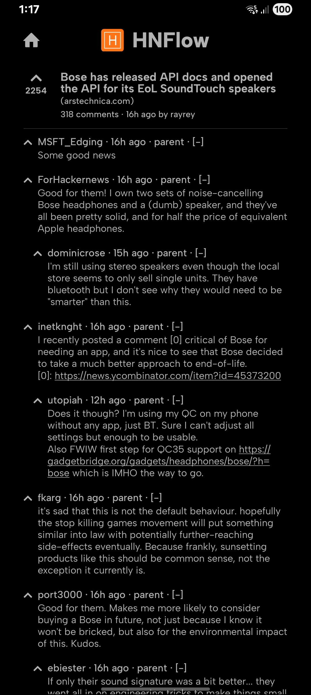
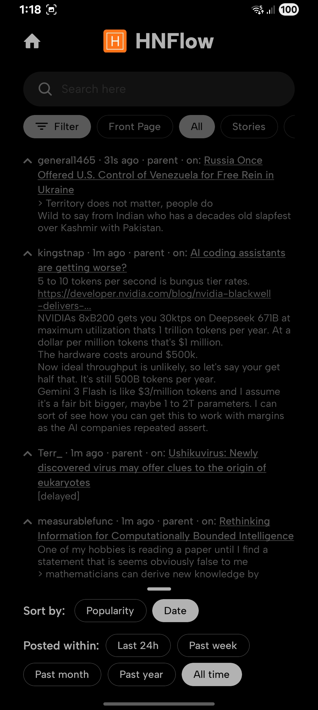

# HNFlow

A modern, cross-platform Hacker News client built with React Native and Expo. Browse stories, comments, jobs, and more from Hacker News with a beautiful, native mobile experience.

## Screenshots

<p align="center">
  
  
  
</p>

## Features

- 🔍 **Advanced Search**: Search through Hacker News stories and comments with real-time filtering
- 📱 **Cross-Platform**: Works on iOS, Android, and Web
- 🎨 **Modern UI**: Beautiful dark-themed interface built with NativeWind (Tailwind CSS)
- 📰 **Content Types**: Browse Front Page, Stories, Comments, Ask HN, Show HN, Launch HN, Jobs, and Polls
- 💬 **Threaded Comments**: View nested comment threads with collapsible comments
- 🔄 **Sorting Options**: Sort by popularity or date
- 📄 **Pagination**: Navigate through multiple pages of results
- ⚡ **Fast & Responsive**: Optimized for performance with efficient data fetching

## Tech Stack

- **Framework**: [Expo](https://expo.dev) ~54.0.30
- **React Native**: 0.81.5
- **React**: 19.1.0
- **Routing**: [Expo Router](https://docs.expo.dev/router/introduction/) (file-based routing)
- **Styling**: [NativeWind](https://www.nativewind.dev/) v4 (Tailwind CSS for React Native)
- **UI Components**:
  - [@gorhom/bottom-sheet](https://github.com/gorhom/react-native-bottom-sheet) for modal interactions
  - [@expo/vector-icons](https://docs.expo.dev/guides/icons/) for icons
- **HTML Rendering**: [react-native-render-html](https://github.com/meliorence/react-native-render-html)
- **API**: [Hacker News Algolia API](https://hn.algolia.com/api)

## Prerequisites

- Node.js (v18 or higher recommended)
- npm or yarn
- Expo CLI (installed globally or via npx)
- For iOS development: Xcode (macOS only)
- For Android development: Android Studio

## Installation

1. Clone the repository:

   ```bash
   git clone https://github.com/srijxnnn/hnflow.git
   cd hnflow
   ```

2. Install dependencies:

   ```bash
   npm install
   ```

3. Start the development server:
   ```bash
   npm start
   # or
   npx expo start
   ```

## Running the App

### Development

Start the Expo development server:

```bash
npm start
```

Then choose your platform:

- Press `i` to open iOS simulator
- Press `a` to open Android emulator
- Press `w` to open in web browser
- Scan the QR code with Expo Go app on your device

### Platform-Specific Commands

```bash
# iOS
npm run ios

# Android
npm run android

# Web
npm run web
```

### Search & Filtering

The app uses the Hacker News Algolia API to provide powerful search capabilities:

- **Query Search**: Real-time search with 250ms debounce
- **Tag Filtering**: Filter by content type (Front Page, Stories, Comments, Jobs, etc.)
- **Sorting**: Sort results by popularity or date
- **Pagination**: Navigate through search result pages

### Comment Threading

- Nested comment threads with visual indentation
- Collapsible comments to hide/show thread branches
- Maximum depth of 3 levels before showing "Continue thread" link
- Support for HTML content in comments

### Story Details

- View full story content with metadata (points, author, time)
- Open external links in browser
- View all comments for a story
- Support for different item types (stories, jobs, polls)

## API Usage

The app uses the [Hacker News Algolia API](https://hn.algolia.com/api):

- **Search Endpoint**: `http://hn.algolia.com/api/v1/search` (popularity) or `search_by_date` (date)
- **Item Endpoint**: `http://hn.algolia.com/api/v1/items/{id}`

See `api/hn.ts` for implementation details.

## Development

### Linting

```bash
npm run lint
```

### TypeScript

The project uses TypeScript for type safety. Type definitions are in `types/api.d.ts`.

### Styling

The app uses NativeWind (Tailwind CSS) for styling. Configure Tailwind in `tailwind.config.js`.

### Custom Fonts

The app uses Albert Sans font family. Fonts are located in `assets/fonts/`.

## Building for Production

### EAS Build

The project includes `eas.json` for building with [Expo Application Services](https://docs.expo.dev/build/introduction/):

```bash
# Install EAS CLI
npm install -g eas-cli

# Configure EAS
eas build:configure

# Build for iOS
eas build --platform ios

# Build for Android
eas build --platform android
```

## Contributing

Contributions are welcome! Please feel free to submit a Pull Request.

## License

See [LICENSE.md](LICENSE.md)

## Acknowledgments

- [Hacker News](https://news.ycombinator.com/) for the content
- [Algolia](https://www.algolia.com/) for the Hacker News Search API
- [Expo](https://expo.dev) for the amazing development platform
